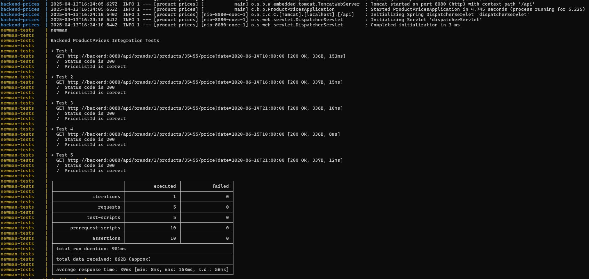

# Product Prices

This Spring Boot project exposes a REST API with an endpoint to query the price of a product in a specific date. 
The data is saved in a H2 database.

## Tests

You can compile the project and check that all the tests pass succesfully with this command:
```
mvn clean package
```

## Execution

You need to execute 2 commands to start-up the application that is going to be tested:

Build the docker image of the application:
```
docker build -t backend-prices .
```
Execute a container of that image:
```
docker run -p 8080:8080 backend-prices
```

## Test the application

This project includes Swagger UI for interactive API documentation and testing.
There you can see the details of the only endpoint exposed.

To access Swagger UI, visit:
```
http://localhost:8080/api/swagger-ui/index.html
```

## Run the acceptance tests

There is a postman collection in the acceptance-tests folder with the tests requested for this project.
It can be executed with the following command:
```
docker-compose up --build
```

You should see the results like this:

